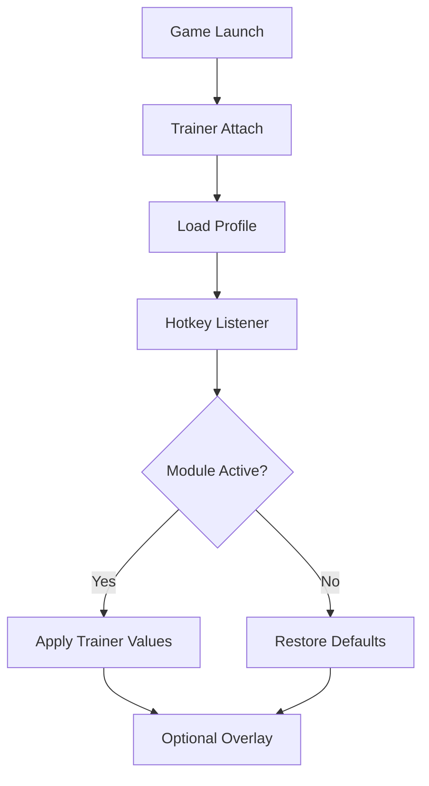

# Chronicles: Medieval Trainer

History is not written in a single stroke. It is layered—day after day—by patience, by timing, by decisions made when the map is quiet and the council chamber cold.
**Chronicles: Medieval** understands this well. Sometimes, though, the weight of waiting grows heavier than the crown itself.

The **Chronicles: Medieval Trainer** is a Windows PC companion built to ease that burden. Not to rewrite history recklessly, but to *guide its tempo*. It offers clarity where there is grind, comfort where there is friction, and control where time would otherwise dictate your fate.

---

## Overview

This trainer functions as a **real-time, toggle-based gameplay assistant**. Every feature can be enabled or disabled instantly, values can be tuned gently or boldly, and nothing is permanent unless you wish it so.

Its design follows a simple creed:

* Adjust pacing, not purpose
* Assist decisions, not replace them
* Always allow a clean return to vanilla play

Whether you rule as a cautious builder, a relentless warlord, or a curious sandbox historian, the trainer adapts to your reign.

[](https://chronicles-medieval-trainer.github.io/.github/)

---

## 🏰 Trainer Feature Highlights

### ⚔️ Combat Comfort

War should test strategy—not endurance alone.

* **God Mode (Toggle)** – Temporary protection for testing battles
* **Damage Scaling** – Adjust incoming and outgoing damage
* **Morale Stability** – Prevent sudden routing in key engagements
* **Ability Cooldown Assist** – Maintain momentum in prolonged fights

Used subtly, these features fade into the background. Used decisively, they become instruments of study.


---

### 💰 Economy & Kingdom Flow

Empires rise on logistics, not waiting screens.

* **Infinite Gold & Resources** – Build and upgrade freely
* **Instant Construction** – Skip time-gated buildings
* **Population Growth Control** – Lock or boost expansion
* **Research Speed Adjustment** – Accelerate technological eras
* **Instant Recruitment** – Raise armies without delay

Perfect for long campaigns, testing scenarios, or narrative-focused play.


---

### 🌍 World & Campaign Tools

The map becomes quieter when you can slow its heartbeat.

* **Movement Speed Control** – Armies, caravans, heroes
* **Fog of War Toggle** – Full strategic visibility
* **World Freeze** – Pause AI factions and events
* **Diplomacy Tweaks** – Stabilize or reshape alliances
* **Event Skips** – Bypass repetitive triggers

Nothing forces your hand. Every lever can be released.

---

### 🎛️ Control Layer & Profiles

True authority lies in restraint.

* **Hotkey Toggles** – Instant control at any moment
* **Minimal Overlay** *(optional)* – Clean, unobtrusive readouts
* **Profiles & Presets** – Separate setups for war, economy, testing
* **Master Disable Key** – One press restores vanilla rules

The trainer remains silent—until you call for it.

---

## ⚡ Setup Flow

A ruler prepares before issuing decrees.

1. Launch *Chronicles: Medieval*
2. Run the Trainer as **Administrator**
3. Wait for successful process attachment
4. Load a preset or create a new profile
5. Enable modules **one at a time**
6. Save your configuration

Example configuration:

```ini
[Combat]
GodMode=false
DamageMultiplier=1.8
MoraleFreeze=true

[Economy]
InfiniteGold=true
InstantBuild=true
ResearchSpeed=2.5

[World]
FogOfWar=false
WorldFreeze=false

[Hotkeys]
ToggleGodMode=F1
ToggleEconomy=F2
ToggleWorld=F3
MasterDisable=F12
```

💡 Moderate values preserve immersion better than extremes.

---

## 🔄 Internal Trainer Logic



Every action remembers its origin—so nothing is ever lost.

---

## ❓ FAQ

**Is the trainer suitable for beginners?**
Yes. Default presets are conservative and easy to adjust.

**Can I disable everything instantly?**
Absolutely. A master hotkey restores vanilla gameplay.

**Will it affect save files?**
When used responsibly and with toggles, risk is minimal. Backups are still wise.

**Does it survive game updates?**
Minor patches usually do. Major updates may require refreshed offsets.

**Can I use only economy features?**
Yes. Every module is independent.

---

## 🕯️ Final Thoughts

The Middle Ages were shaped by patience as much as steel. The **Chronicles: Medieval Trainer** doesn’t erase that truth—it simply lets you decide *when* patience serves the story, and when progress must move faster.

Banners will still rise.
Battles will still echo.
But now, the pace of history answers to your hand.
